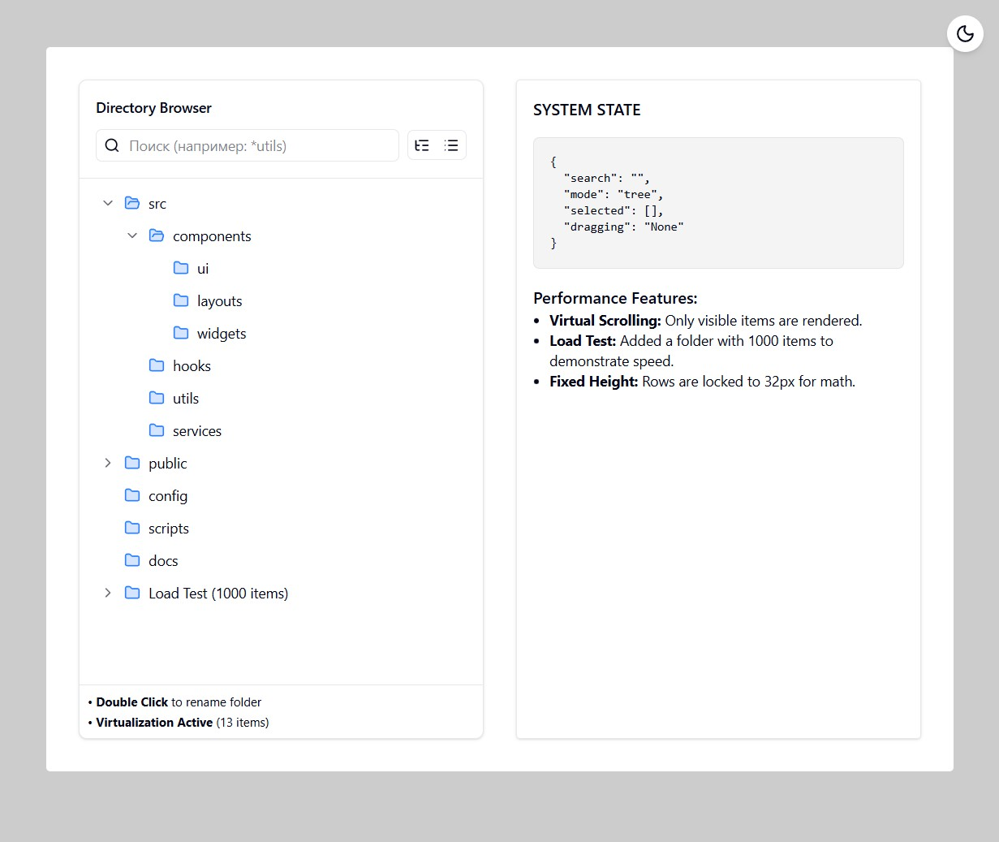

A React + TypeScript playground that implements a folder treeview (directory manager) with drag-and-drop powered by dnd-kit, multi-selection, search, inline renaming (double click), and virtualized rendering for smooth performance on large datasets.



## Getting Started

### Install

```bash
pnpm install
```

### Run

```bash
pnpm dev
```

## License

[MIT](LICENSE)